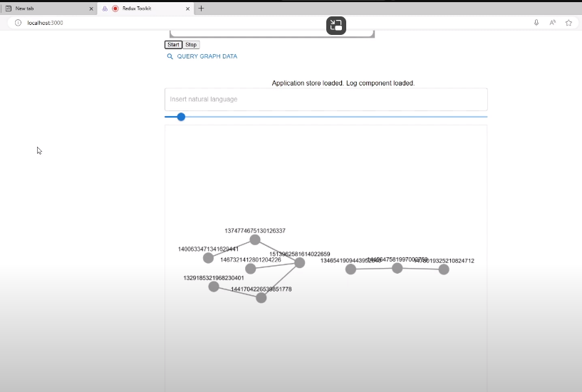
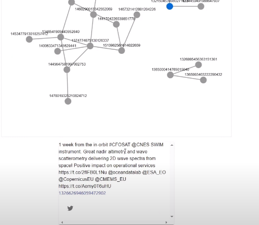

## Cytoscape with Embedding Based Retrieval 

This small machine learning project recognizes the user's voice and by computing embeddings it retrieves relevant data from a database. There are various heuristics for expanding the search graph, and tools that can be used to find related content based on vector embedding similarity. For the full NLP analysis some other Python tools can be used.




## Redux Toolkit TypeScript Example

This example shows how to integrate Next.js with [Redux Toolkit](https://redux-toolkit.js.org).

The **Redux Toolkit** is a standardized way to write Redux logic (create actions and reducers, setup the store with some default middlewares like redux devtools extension). This example demonstrates each of these features with Next.js

## Deploy your own

Deploy the example using [Vercel](https://vercel.com?utm_source=github&utm_medium=readme&utm_campaign=next-example):

[](https://vercel.com/new/clone?repository-url=https://github.com/vercel/next.js/tree/canary/examples/with-redux&project-name=with-redux&repository-name=with-redux)

## How to use

Execute [`create-next-app`](https://github.com/vercel/next.js/tree/canary/packages/create-next-app) with [npm](https://docs.npmjs.com/cli/init), [Yarn](https://yarnpkg.com/lang/en/docs/cli/create/), or [pnpm](https://pnpm.io) to bootstrap the example:

```bash
npx create-next-app --example with-redux with-redux-app
```

```bash
yarn create next-app --example with-redux with-redux-app
```

```bash
pnpm create next-app --example with-redux with-redux-app
```

Deploy it to the cloud with [Vercel](https://vercel.com/new?utm_source=github&utm_medium=readme&utm_campaign=next-example) ([Documentation](https://nextjs.org/docs/deployment)).
